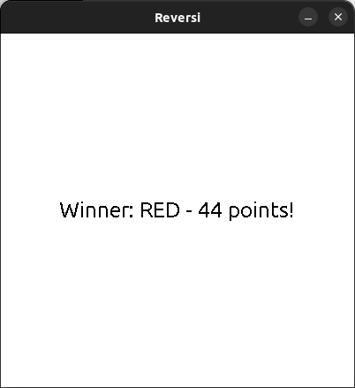

# Reversi
Reversi is a strategy board game for two players, played on an 8×8 uncheckered board; invented in 1883.

## Game idea
Two players compete, using 64 identical game pieces ("disks") that are light on one side and dark on the other. Each player chooses one color to use throughout the game. Players take turns placing one disk on an empty square, with their assigned color facing up. After a play is made, any disks of the opponent's color that lie in a straight line bounded by the one just played and another one in the current player's color are turned over. When all playable empty squares are filled, the player with more disks showing in their own color wins the game [source: Wikipedia](https://en.wikipedia.org/wiki/Reversi).

## Gameplay images

    

    
    
    

    

    
    
    

